# Cityscapes vs SYNTHIA Dataset Comparison

This report presents metrics for the DAFormer model trained on SYNTHIA (source) and evaluated on Cityscapes (target). Metrics were obtained by evaluating the trained model on the Cityscapes validation set (3 cities, 500 images) and on a 500-image subset of SYNTHIA.

## View Examples

The following images illustrate the appearance and field-of-view of the Cityscapes and SYNTHIA datasets.

| Cityscapes | Synthia |
|-----------|-----------|
|  | 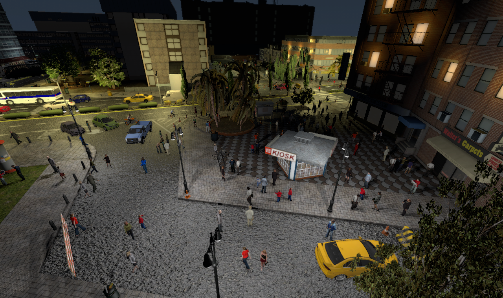 |
| 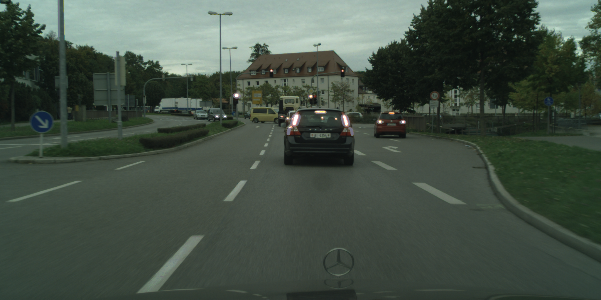 | 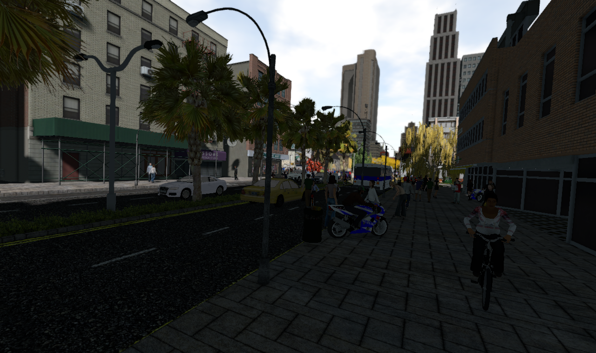 |  

## Whole-Image Statistics

The table below shows mIoU and average global error for Cityscapes and SYNTHIA. mIoU shows an approximate 15% gap, while average global error differs by about 6.5%.

Definitions:
- mIoU: For calculating the mIoU, pixels are aggregated across all images and IoU is computed over all pixels combined.
- Average Global Error: the mean per-image pixel error (excluding ignored pixels).

| Metric | Cityscapes | SYNTHIA |
|---|---:|---:|
| mIoU | 61.20% | 76.09% |
| Average Global Error | 11.54% | 4.98% |

### 4x4 Grid Analysis

Each image is divided into a 4x4 grid. The plot below shows the error for each grid cell computed over 500 images for Cityscapes and SYNTHIA.

There is a strong spatial mismatch between the datasets: Cityscapes and SYNTHIA exhibit opposite error patterns. In Cityscapes, errors concentrate in the lower half of the image (rows 2–3). In SYNTHIA the bottom row is highly reliable, and the most difficult regions for small objects appear in the upper and middle rows.

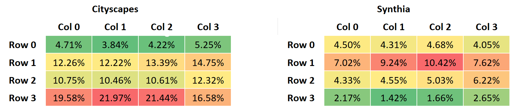

<!-- | Cityscpes | Synthia |
|-----------|-----------|
| 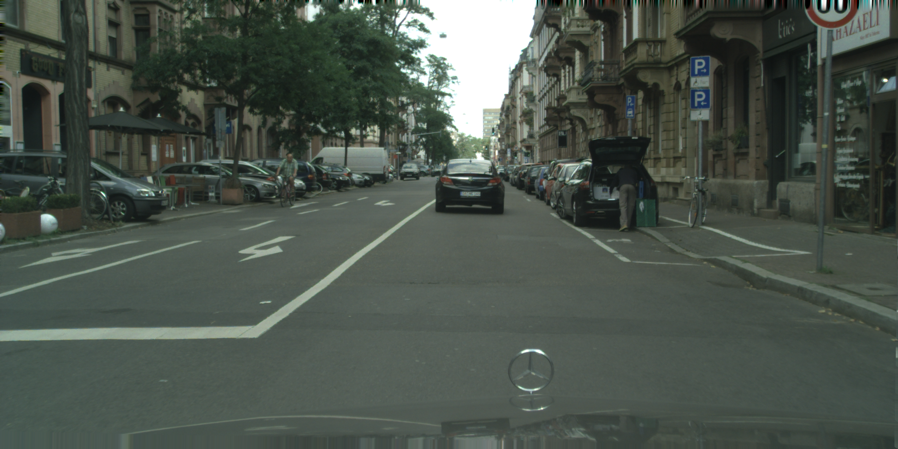 | 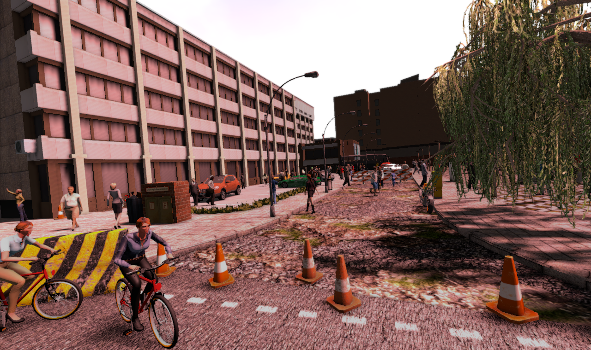 |
 -->

### 4x4 Grid by Class: Spatial Error Distribution by Representation (Top 5)

The following tables show the top 5 most represented classes (with their errors) for each cell of the grid for Cityscapes and Synthia.

| Cityscapes | Col 0 | Col 1 | Col 2 | Col 3 |
|:---:|:---:|:---:|:---:|:---:|
| Row 0 | Building (51.12%) (Err: 3.81%) Vegetation (38.06%) (Err: 4.36%) Sky (6.72%) (Err: 0.88%) Pole (1.71%) (Err: 29.03%) Traffic sign (1.01%) (Err: 12.87%) | Vegetation (40.08%) (Err: 4.37%) Building (37.02%) (Err: 3.32%) Sky (20.73%) (Err: 0.87%) Pole (1.09%) (Err: 42.56%) Traffic sign (0.45%) (Err: 14.71%) | Vegetation (40.22%) (Err: 4.05%) Building (40.15%) (Err: 3.52%) Sky (16.50%) (Err: 1.24%) Pole (1.33%) (Err: 41.56%) Traffic sign (1.00%) (Err: 12.11%) | Building (56.22%) (Err: 3.64%) Vegetation (34.43%) (Err: 3.91%) Sky (3.24%) (Err: 1.42%) Traffic sign (2.34%) (Err: 14.18%) Pole (1.91%) (Err: 30.60%) |
| Row 1 | Building (39.89%) (Err: 7.54%) Vegetation (24.02%) (Err: 6.53%) Car (15.95%) (Err: 2.90%) Pole (3.37%) (Err: 32.37%) Person (3.13%) (Err: 12.46%) | Building (30.63%) (Err: 9.21%) Vegetation (27.76%) (Err: 5.98%) Car (14.61%) (Err: 4.03%) Road (8.90%) (Err: 10.49%) Person (3.77%) (Err: 12.46%) | Building (29.88%) (Err: 9.66%) Vegetation (26.20%) (Err: 6.00%) Car (14.49%) (Err: 4.45%) Road (8.63%) (Err: 11.64%) Person (4.28%) (Err: 12.44%) | Building (38.37%) (Err: 8.12%) Vegetation (21.64%) (Err: 7.04%) Car (15.25%) (Err: 3.49%) Fence (4.33%) (Err: 95.56%) Person (4.06%) (Err: 11.70%) |
| Row 2 | Road (58.66%) (Err: 7.27%) Sidewalk (14.69%) (Err: 14.28%) Car (13.74%) (Err: 4.63%) Vegetation (3.03%) (Err: 22.88%) Building (2.74%) (Err: 21.79%) | Road (86.25%) (Err: 8.83%) Sidewalk (5.02%) (Err: 16.04%) Car (3.98%) (Err: 7.53%) Person (1.13%) (Err: 9.65%) Vegetation (0.92%) (Err: 36.29%) | Road (84.05%) (Err: 9.23%) Sidewalk (7.86%) (Err: 13.21%) Car (4.00%) (Err: 7.77%) Person (1.11%) (Err: 9.05%) Building (0.79%) (Err: 15.10%) | Road (43.85%) (Err: 8.74%) Sidewalk (28.70%) (Err: 13.39%) Car (14.03%) (Err: 4.28%) Building (3.56%) (Err: 13.50%) Vegetation (3.03%) (Err: 28.83%) |
| Row 3 | Road (92.34%) (Err: 20.63%) Sidewalk (4.59%) (Err: 8.45%) Car (1.82%) (Err: 9.74%) Vegetation (0.44%) (Err: 48.89%) Wall (0.41%) (Err: 18.41%) | Road (99.43%) (Err: 23.80%) Sidewalk (0.52%) (Err: 9.75%) Person (0.04%) (Err: 5.64%) Car (0.01%) (Err: 9.70%) Vegetation (0.01%) (Err: 100.00%) | Road (99.44%) (Err: 23.46%) Sidewalk (0.43%) (Err: 31.96%) Car (0.08%) (Err: 44.97%) Person (0.06%) (Err: 3.22%) | Road (84.89%) (Err: 19.01%) Sidewalk (12.70%) (Err: 10.54%) Car (1.65%) (Err: 11.61%) Vegetation (0.40%) (Err: 38.36%) Fence (0.13%) (Err: 46.53%) |

Cityscapes analysis: The model has low error in the top rows (0 and 1), which are dominated by Building and Vegetation. However, Row 3 — dominated by Road — still shows high error. This likely reflects geometric and viewpoint differences (camera position and scene layout) between the datasets.

| Synthia | Col 0 | Col 1 | Col 2 | Col 3 |
|:---:|:---:|:---:|:---:|:---:|
| Row 0 | Building (61.55%) (Err: 3.00%) Sky (19.74%) (Err: 1.62%) Vegetation (14.82%) (Err: 8.53%) Pole (0.87%) (Err: 33.31%) Sidewalk (0.85%) (Err: 29.24%) | Building (50.36%) (Err: 2.73%) Sky (31.95%) (Err: 2.24%) Vegetation (13.19%) (Err: 7.48%) Sidewalk (1.11%) (Err: 19.95%) Road (0.94%) (Err: 18.38%) | Building (50.42%) (Err: 2.68%) Sky (32.78%) (Err: 2.98%) Vegetation (12.67%) (Err: 9.04%) Sidewalk (1.08%) (Err: 20.25%) Pole (0.89%) (Err: 40.96%) | Building (62.42%) (Err: 2.61%) Sky (20.29%) (Err: 3.41%) Vegetation (14.01%) (Err: 6.54%) Pole (0.98%) (Err: 28.63%) Sidewalk (0.78%) (Err: 17.41%) |
| Row 1 | Building (49.21%) (Err: 3.05%) Vegetation (17.56%) (Err: 6.92%) Sidewalk (7.42%) (Err: 11.08%) Road (7.40%) (Err: 10.05%) Bus (5.50%) (Err: 5.36%) | Building (39.09%) (Err: 3.78%) Vegetation (19.33%) (Err: 6.86%) Sidewalk (10.42%) (Err: 13.02%) Road (10.42%) (Err: 10.71%) Person (6.25%) (Err: 19.26%) | Building (40.37%) (Err: 5.54%) Vegetation (20.31%) (Err: 6.90%) Sidewalk (11.23%) (Err: 13.52%) Road (9.61%) (Err: 12.35%) Person (6.30%) (Err: 22.60%) | Building (55.32%) (Err: 3.39%) Vegetation (19.27%) (Err: 6.90%) Sidewalk (7.96%) (Err: 11.89%) Road (5.07%) (Err: 14.20%) Person (4.60%) (Err: 23.09%) |
| Row 2 | Road (27.06%) (Err: 3.37%) Sidewalk (26.79%) (Err: 3.51%) Building (14.51%) (Err: 2.16%) Car (9.22%) (Err: 3.18%) Vegetation (8.77%) (Err: 6.29%) | Road (35.40%) (Err: 3.07%) Sidewalk (31.34%) (Err: 3.38%) Car (7.95%) (Err: 3.34%) Person (7.68%) (Err: 8.65%) Vegetation (7.19%) (Err: 6.12%) | Sidewalk (34.90%) (Err: 3.63%) Road (34.11%) (Err: 3.31%) Person (8.36%) (Err: 10.72%) Car (6.48%) (Err: 3.67%) Vegetation (5.63%) (Err: 6.38%) | Sidewalk (32.50%) (Err: 4.63%) Road (22.48%) (Err: 4.62%) Building (15.44%) (Err: 2.96%) Person (9.17%) (Err: 12.25%) Vegetation (7.93%) (Err: 9.01%) |
| Row 3 | Road (38.01%) (Err: 1.03%) Sidewalk (35.71%) (Err: 1.36%) Car (7.10%) (Err: 1.12%) Building (6.40%) (Err: 3.90%) Vegetation (4.46%) (Err: 10.35%) | Sidewalk (42.20%) (Err: 1.15%) Road (41.26%) (Err: 0.75%) Car (5.22%) (Err: 0.93%) Person (3.96%) (Err: 4.25%) Vegetation (2.59%) (Err: 8.43%) | Sidewalk (43.75%) (Err: 1.30%) Road (39.90%) (Err: 1.00%) Car (4.52%) (Err: 0.99%) Person (4.16%) (Err: 6.24%) Building (2.96%) (Err: 1.03%) | Sidewalk (40.35%) (Err: 1.82%) Road (34.99%) (Err: 1.70%) Building (6.83%) (Err: 0.87%) Car (6.10%) (Err: 1.29%) Person (4.77%) (Err: 8.77%) |

SYNTHIA analysis: Unlike Cityscapes, the bottom row shows much lower error for dominant classes such as Road and Sidewalk. The top rows are dominated by Building, Sky, and Vegetation, which also show low error.

### 4x4 Grid by Class: Error Distribution by Spatial Region (Filtered by Representation > 0.5%) (Top 5)

The following tables show the top 5 classes with the highest errors for each cell of the grid for Cityscapes and Synthia. We set a minimum representation threshold of 0.5% to filter noisy, extremely rare classes (e.g., very small counts of Person in distant grid cells).

| Cityscapes | Col 0 | Col 1 | Col 2 | Col 3 |
|:---:|:---:|:---:|:---:|:---:|
| Row 0 | Pole (1.71%) (Err: 29.03%) Traffic sign (1.01%) (Err: 12.87%) Vegetation (38.06%) (Err: 4.36%) Building (51.12%) (Err: 3.81%) Sky (6.72%) (Err: 0.88%) | Pole (1.09%) (Err: 42.56%) Vegetation (40.08%) (Err: 4.37%) Building (37.02%) (Err: 3.32%) Sky (20.73%) (Err: 0.87%) | Pole (1.33%) (Err: 41.56%) Traffic sign (1.00%) (Err: 12.11%) Vegetation (40.22%) (Err: 4.05%) Building (40.15%) (Err: 3.52%) Sky (16.50%) (Err: 1.24%) | Fence (0.58%) (Err: 100.00%) Pole (1.91%) (Err: 30.60%) Traffic light (0.58%) (Err: 16.34%) Traffic sign (2.34%) (Err: 14.18%) Vegetation (34.43%) (Err: 3.91%) |
| Row 1 | Fence (2.58%) (Err: 90.59%) Traffic sign (0.92%) (Err: 44.67%) Rider (0.53%) (Err: 37.36%) Wall (2.00%) (Err: 33.15%) Pole (3.37%) (Err: 32.37%) | Fence (1.07%) (Err: 89.43%) Pole (2.97%) (Err: 53.29%) Traffic sign (1.00%) (Err: 51.00%) Bicycle (1.28%) (Err: 36.88%) Rider (0.84%) (Err: 34.45%) | Fence (1.25%) (Err: 93.92%) Wall (1.13%) (Err: 53.54%) Pole (3.34%) (Err: 52.26%) Traffic sign (1.66%) (Err: 34.24%) Bicycle (1.40%) (Err: 33.83%) | Fence (4.33%) (Err: 95.56%) Wall (2.42%) (Err: 41.52%) Traffic sign (0.97%) (Err: 34.48%) Sidewalk (3.54%) (Err: 31.22%) Bicycle (1.85%) (Err: 28.68%) |
| Row 2 | Fence (1.02%) (Err: 78.07%) Bicycle (1.76%) (Err: 26.53%) Vegetation (3.03%) (Err: 22.88%) Pole (1.01%) (Err: 21.89%) Building (2.74%) (Err: 21.79%) | Vegetation (0.92%) (Err: 36.29%) Bicycle (0.56%) (Err: 31.95%) Building (0.89%) (Err: 26.12%) Sidewalk (5.02%) (Err: 16.04%) Person (1.13%) (Err: 9.65%) | Bicycle (0.69%) (Err: 32.94%) Vegetation (0.66%) (Err: 24.51%) Building (0.79%) (Err: 15.10%) Sidewalk (7.86%) (Err: 13.21%) Road (84.05%) (Err: 9.23%) | Fence (1.10%) (Err: 79.40%) Vegetation (3.03%) (Err: 28.83%) Bicycle (1.72%) (Err: 25.63%) Wall (0.90%) (Err: 25.61%) Pole (1.59%) (Err: 14.94%) |
| Row 3 | Road (92.34%) (Err: 20.63%) Car (1.82%) (Err: 9.74%) Sidewalk (4.59%) (Err: 8.45%) | Road (99.43%) (Err: 23.80%) Sidewalk (0.52%) (Err: 9.75%) | Road (99.44%) (Err: 23.46%) | Road (84.89%) (Err: 19.01%) Car (1.65%) (Err: 11.61%) Sidewalk (12.70%) (Err: 10.54%) |

Cityscapes analysis: In the top rows (0 and 1), the largest errors are concentrated on thin structures such as Pole and Traffic Sign, especially against complex backgrounds. Fence is also often missed in these rows. Overall, the model struggles most with small, low-support classes rather than with dominant background regions.

| Synthia | Col 0 | Col 1 | Col 2 | Col 3 |
|:---:|:---:|:---:|:---:|:---:|
| Row 0 | Pole (0.87%) (Err: 33.31%) Sidewalk (0.85%) (Err: 29.24%) Road (0.75%) (Err: 18.57%) Bus (0.51%) (Err: 10.54%) Vegetation (14.82%) (Err: 8.53%) | Pole (0.93%) (Err: 39.76%) Sidewalk (1.11%) (Err: 19.95%) Road (0.94%) (Err: 18.38%) Vegetation (13.19%) (Err: 7.48%) Building (50.36%) (Err: 2.73%) | Pole (0.89%) (Err: 40.96%) Road (0.79%) (Err: 23.60%) Sidewalk (1.08%) (Err: 20.25%) Car (0.53%) (Err: 17.50%) Vegetation (12.67%) (Err: 9.04%) | Pole (0.98%) (Err: 28.63%) Sidewalk (0.78%) (Err: 17.41%) Vegetation (14.01%) (Err: 6.54%) Sky (20.29%) (Err: 3.41%) Building (62.42%) (Err: 2.61%) |
| Row 1 | Pole (1.39%) (Err: 39.69%) Person (3.67%) (Err: 18.44%) Sidewalk (7.42%) (Err: 11.08%) Road (7.40%) (Err: 10.05%) Wall (0.77%) (Err: 9.44%) | Rider (0.64%) (Err: 52.62%) Pole (1.62%) (Err: 48.56%) Person (6.25%) (Err: 19.26%) Sidewalk (10.42%) (Err: 13.02%) Car (4.23%) (Err: 11.83%) | Rider (0.55%) (Err: 55.55%) Pole (1.54%) (Err: 47.77%) Person (6.30%) (Err: 22.60%) Sidewalk (11.23%) (Err: 13.52%) Car (3.68%) (Err: 13.18%) | Pole (1.41%) (Err: 40.29%) Person (4.60%) (Err: 23.09%) Road (5.07%) (Err: 14.20%) Car (2.33%) (Err: 13.57%) Sidewalk (7.96%) (Err: 11.89%) |
| Row 2 | Bicycle (0.50%) (Err: 41.51%) Pole (0.76%) (Err: 18.36%) Rider (1.17%) (Err: 14.69%) Person (6.05%) (Err: 7.49%) Vegetation (8.77%) (Err: 6.29%) | Pole (0.74%) (Err: 19.39%) Rider (1.06%) (Err: 19.11%) Motorcycle (0.72%) (Err: 15.65%) Person (7.68%) (Err: 8.65%) Fence (0.75%) (Err: 8.28%) | Pole (1.04%) (Err: 22.32%) Rider (0.96%) (Err: 21.22%) Person (8.36%) (Err: 10.72%) Fence (1.06%) (Err: 8.61%) Vegetation (5.63%) (Err: 6.38%) | Rider (0.94%) (Err: 24.53%) Pole (1.14%) (Err: 23.30%) Person (9.17%) (Err: 12.25%) Fence (0.57%) (Err: 12.12%) Vegetation (7.93%) (Err: 9.01%) |
| Row 3 | Rider (0.73%) (Err: 17.56%) Vegetation (4.46%) (Err: 10.35%) Person (3.99%) (Err: 4.29%) Building (6.40%) (Err: 3.90%) Sidewalk (35.71%) (Err: 1.36%) | Vegetation (2.59%) (Err: 8.43%) Rider (0.51%) (Err: 7.69%) Person (3.96%) (Err: 4.25%) Building (2.08%) (Err: 2.44%) Sidewalk (42.20%) (Err: 1.15%) | Pole (0.57%) (Err: 10.17%) Vegetation (1.90%) (Err: 8.48%) Person (4.16%) (Err: 6.24%) Sidewalk (43.75%) (Err: 1.30%) Building (2.96%) (Err: 1.03%) | Rider (0.68%) (Err: 15.89%) Person (4.77%) (Err: 8.77%) Vegetation (4.07%) (Err: 7.79%) Bus (0.87%) (Err: 4.85%) Sidewalk (40.35%) (Err: 1.82%) |

SYNTHIA analysis: In SYNTHIA, Fence appears less frequently and is generally easier for the model than in Cityscapes, likely because the class has a different semantic definition across datasets. As in Cityscapes, thin structures remain difficult and are often absorbed into nearby background classes, producing higher errors, especially in the top rows (0 and 1).

## Class-by-Class Comparison

The following sections show 4 sample images (2 from Cityscapes, 2 from SYNTHIA) and their corresponding semantic labels for each of the 16 classes (Terrain, Truck and Train classes are not present in SYNTHIA dataset). 

### Definitions:
- Representativity: How much of the dataset (or a specific image) is made up of a specific class. Total pixels of Class A / Total pixels of all classes.
- IoU: Area of Overlap / Area of Union
- Accuracy: The percentage of pixels belonging to a class that your model predicted correctly. Correctly predicted pixels of Class A / Total ground truth pixels of Class A
- Error: The direct opposite of Accuracy. Error pixels of Class A / Total ground truth pixels of Class A (or 1 - Accuracy)
<!-- - Average Representation: The average percentage of a class per image, rather than across the whole dataset pool. Sum of (Representation of Class A in Image 1, Image 2, etc.) / Total number of images
- Average Error: Sum of (Error Rate of Class A in Image 1, Image 2, etc.) / Total number of images -->

### 1. Road
| Metric | Cityscapes | SYNTHIA |
|---|---:|---:|
| Representativity | 38.14% | 18.97% |
| IoU | 82.15% | 94.39% |
| Accuracy | 84.95% | 96.65% |
| Error | 15.05% | 3.35% |
| Confused Classes (Top 3) |  sidewalk (12.16%) vegetation (1.50%) car (0.56%)  | vegetation (0.84%) sidewalk (0.80%) person (0.68%) |

*Comment:* Road is the dominant class; Cityscapes shows notable error (often confused with sidewalk), while SYNTHIA predictions are very accurate.
<!-- | Average Representation | 37.71% | 19.05% |
| Average Error | 15.19% | 9.03% | -->

**Samples 1-2:**
| CS Image 1 | CS Image 2 | SYNTHIA Image 1 | SYNTHIA Image 2 |
|-----------|-----------|-----------|-----------|
| 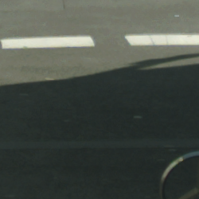 | 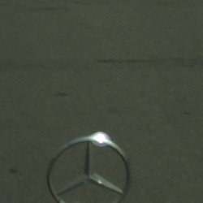 | 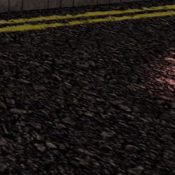 | 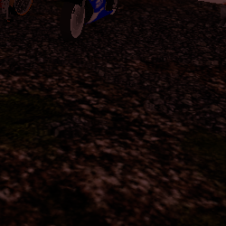 |

| CS Label 1 | CS Label 2 | SYNTHIA Label 1 | SYNTHIA Label 2 |
|-----------|-----------|-----------|-----------|
|  |  | 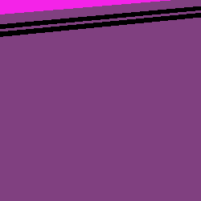 | 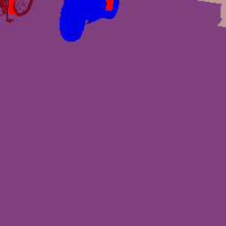 |

<!-- **Samples 3-4:**
| CS Image 3 | CS Image 4 | SYNTHIA Image 3 | SYNTHIA Image 4 |
|-----------|-----------|-----------|-----------|
| 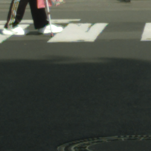 | 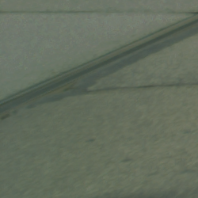 | 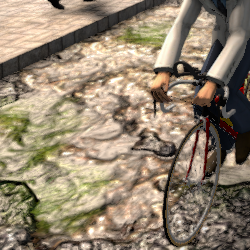 | 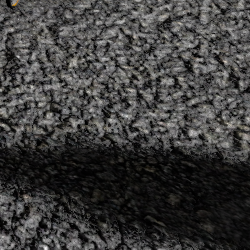 |

| CS Label 3 | CS Label 4 | SYNTHIA Label 3 | SYNTHIA Label 4 |
|-----------|-----------|-----------|-----------|
|  |  | 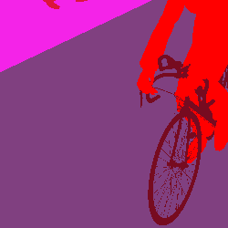 |  | -->

### 2. Sidewalk
| Metric | Cityscapes | SYNTHIA |
|---|---:|---:|
| Representativity | 5.47% | 20.21% |
| IoU | 43.10% | 92.69% |
| Accuracy | 84.19% | 96.15% |
| Error | 15.81% | 3.85% |
| Confused Classes (Top 3) | road (13.04%) vegetation (1.02%) building (0.52%) | vegetation (1.35%) person (1.17%) road (0.41%) |

*Comment:* Sidewalk has lower support in Cityscapes and is frequently mistaken for road; SYNTHIA shows much lower error.
<!-- | Average Representation | 5.38% | 20.14% |
| Average Error | 21.52% | 5.56% | -->

**Samples 1-2:**
| CS Image 1 | CS Image 2 | SYNTHIA Image 1 | SYNTHIA Image 2 |
|-----------|-----------|-----------|----------|
| 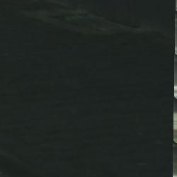 |  | 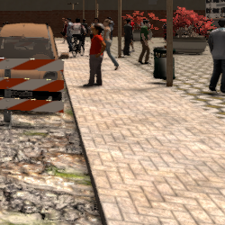 | 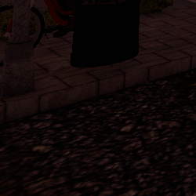 |

| CS Label 1 | CS Label 2 | SYNTHIA Label 1 | SYNTHIA Label 2 |
|-----------|-----------|-----------|----------|
| 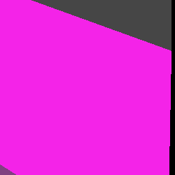 | 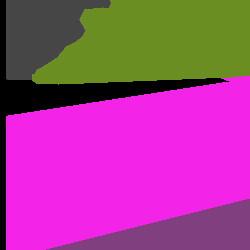 | 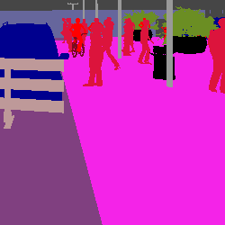 | 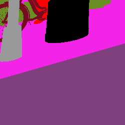 |

<!-- **Samples 3-4:**
| CS Image 3 | CS Image 4 | SYNTHIA Image 3 | SYNTHIA Image 4 |
|-----------|-----------|-----------|----------|
| 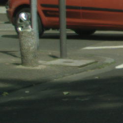 | 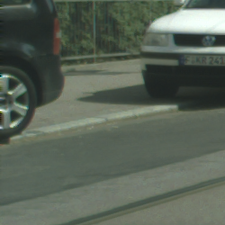 | 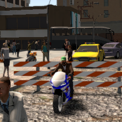 | 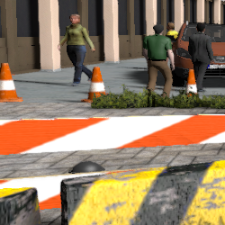 |

| CS Label 3 | CS Label 4 | SYNTHIA Label 3 | SYNTHIA Label 4 |
|-----------|-----------|-----------|----------|
| 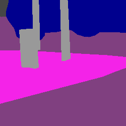 | 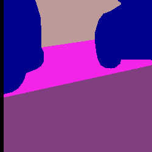 | 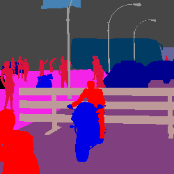 | 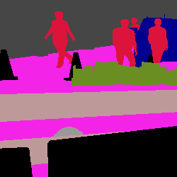 | -->

### 3. Building
| Metric | Cityscapes | SYNTHIA |
|---|---:|---:|
| Representativity | 22.19% | 29.57% |
| IoU | 88.08% | 94.18% |
| Accuracy | 94.00% | 96.82% |
| Error | 6.00% | 3.18% |
| Confused Classes (Top 3) | vegetation (2.32%) pole (0.78%) wall (0.74%) | vegetation (2.21%) person (0.25%) sidewalk (0.25%) |

*Comment:* Building is well recovered overall; remaining errors usually come from nearby vegetation or from small structures such as poles or walls.
<!-- | Average Representation | 22.61% | 29.47% | -->
<!-- | Average Error | 8.94% | 4.24% | -->

**Samples 1-2:**
| CS Image 1 | CS Image 2 | SYNTHIA Image 1 | SYNTHIA Image 2 |
|-----------|-----------|-----------|----------|
|  |  | 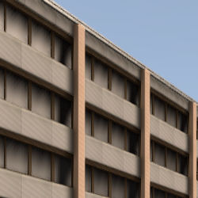 | 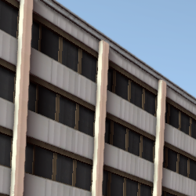 |

| CS Label 1 | CS Label 2 | SYNTHIA Label 1 | SYNTHIA Label 2 |
|-----------|-----------|-----------|----------|
|  |  |  |  |

<!-- **Samples 3-4:**
| CS Image 3 | CS Image 4 | SYNTHIA Image 3 | SYNTHIA Image 4 |
|-----------|-----------|-----------|----------|
| 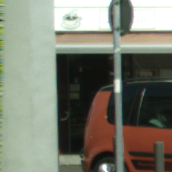 | 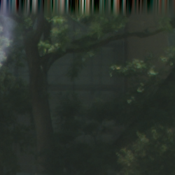 | 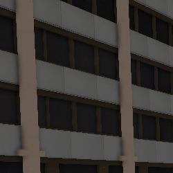 | 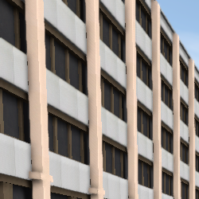 |

| CS Label 3 | CS Label 4 | SYNTHIA Label 3 | SYNTHIA Label 4 |
|-----------|-----------|-----------|----------|
|  |  |  |  | -->

### 4. Wall
| Metric | Cityscapes | SYNTHIA |
|---|---:|---:|
| Representativity | 0.74% | 0.26% |
| IoU | 46.22% | 81.76% |
| Accuracy | 66.13% | 88.04% |
| Error | 33.87% | 11.96% |
| Confused Classes (Top 3) | building (15.92%) sidewalk (6.99%) vegetation (5.76%) | building (3.53%) sidewalk (3.22%) vegetation (2.53%) |

*Comment:* Wall is rare and error-prone in Cityscapes, often labeled as building or sidewalk; SYNTHIA shows fewer confusions.
<!-- | Average Representation | 0.82% | 0.25% |
| Average Error | 27.43% | 20.78% | -->

**Samples 1-2:**
| CS Image 1 | CS Image 2 | SYNTHIA Image 1 | SYNTHIA Image 2 |
|-----------|-----------|-----------|----------|
|  | 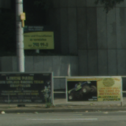 | 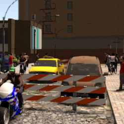 | 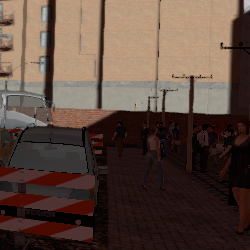 |

| CS Label 1 | CS Label 2 | SYNTHIA Label 1 | SYNTHIA Label 2 |
|-----------|-----------|-----------|----------|
|  | 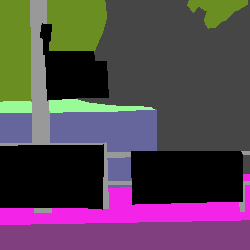 | 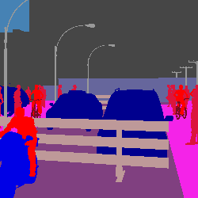 | 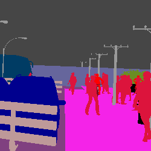 |

<!-- **Samples 3-4:**
| CS Image 3 | CS Image 4 | SYNTHIA Image 3 | SYNTHIA Image 4 |
|-----------|-----------|-----------|----------|
|  | 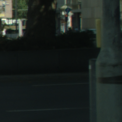 | 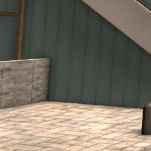 | 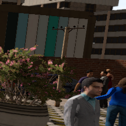 |

| CS Label 3 | CS Label 4 | SYNTHIA Label 3 | SYNTHIA Label 4 |
|-----------|-----------|-----------|----------|
| 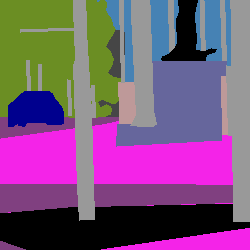 |  | 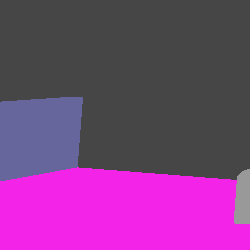 | 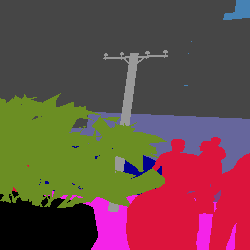 | -->

### 5. Fence

This class is completely dissimilar in the semantic meaning in cityscapes and synthia, causing that the model completely misses in the target validation.

| Metric | Cityscapes | SYNTHIA |
|---|---:|---:|
| Representativity | 0.83% | 0.31% |
| IoU | 8.47% | 77.54% |
| Accuracy | 9.76% | 86.67% |
| Error | 90.24% | 13.33% |
| Confused Classes (Top 3) | building (39.48%) vegetation (17.76%) wall (13.14%) | road (6.10%) sidewalk (1.88%) person (1.60%) |

*Comment:* Fence semantics differ strongly between datasets; Cityscapes fences are often predicted as building/vegetation, while SYNTHIA confuses fence with road/sidewalk.
<!-- | Average Representation | 0.84% | 0.32% |
| Average Error | 35.42% | 44.81% | -->

**Samples 1-2:**
| CS Image 1 | CS Image 2 | SYNTHIA Image 1 | SYNTHIA Image 2 |
|-----------|-----------|-----------|----------|
|  |  |  |  |

| CS Label 1 | CS Label 2 | SYNTHIA Label 1 | SYNTHIA Label 2 |
|-----------|-----------|-----------|----------|
|  |  |  |  |

<!-- **Samples 3-4:**
| CS Image 3 | CS Image 4 | SYNTHIA Image 3 | SYNTHIA Image 4 |
|-----------|-----------|-----------|----------|
|  |  |  |  |

| CS Label 3 | CS Label 4 | SYNTHIA Label 3 | SYNTHIA Label 4 |
|-----------|-----------|-----------|----------|
|  |  |  |  | -->

### 6. Pole
| Metric | Cityscapes | SYNTHIA |
|---|---:|---:|
| Representativity | 1.50% | 0.94% |
| IoU | 50.95% | 55.29% |
| Accuracy | 63.80% | 66.90% |
| Error | 36.20% | 33.10% |
| Confused Classes (Top 3) | building (14.86%) vegetation (9.33%) sidewalk (2.15%) | building (14.10%) sidewalk (5.40%) vegetation (5.04%) |

*Comment:* Pole is a thin, low-support class with high error; it is commonly absorbed into building or vegetation labels in both datasets.
<!-- | Average Representation | 1.52% | 0.94% |
| Average Error | 42.37% | 45.41% | -->

**Samples 1-2:**
| CS Image 1 | CS Image 2 | SYNTHIA Image 1 | SYNTHIA Image 2 |
|-----------|-----------|-----------|----------|
|  |  |  |  |

| CS Label 1 | CS Label 2 | SYNTHIA Label 1 | SYNTHIA Label 2 |
|-----------|-----------|-----------|----------|
|  |  |  |  |

<!-- **Samples 3-4:**
| CS Image 3 | CS Image 4 | SYNTHIA Image 3 | SYNTHIA Image 4 |
|-----------|-----------|-----------|----------|
|  |  |  |  |

| CS Label 3 | CS Label 4 | SYNTHIA Label 3 | SYNTHIA Label 4 |
|-----------|-----------|-----------|----------|
|  |  |  |  | -->

### 7. Traffic Light
| Metric | Cityscapes | SYNTHIA |
|---|---:|---:|
| Representativity | 0.20% | 0.04% |
| IoU | 54.40% | 56.10% |
| Accuracy | 65.92% | 60.87% |
| Error | 34.08% | 39.13% |
| Confused Classes (Top 3) | vegetation (12.37%) building (11.91%) traffic sign (4.53%) | building (20.98%) vegetation (7.60%) pole (2.99%) |

*Comment:* Traffic lights are scarce and often confused with vegetation or nearby buildings in Cityscapes; SYNTHIA mainly mislabels them as building.
<!-- | Average Representation | 0.20% | 0.04% |
| Average Error | 35.78% | 55.62% | -->

**Samples 1-2:**
| CS Image 1 | CS Image 2 | SYNTHIA Image 1 | SYNTHIA Image 2 |
|-----------|-----------|-----------|----------|
|  |  |  |  |

| CS Label 1 | CS Label 2 | SYNTHIA Label 1 | SYNTHIA Label 2 |
|-----------|-----------|-----------|----------|
|  |  |  |  |

<!-- **Samples 3-4:**
| CS Image 3 | CS Image 4 | SYNTHIA Image 3 | SYNTHIA Image 4 |
|-----------|-----------|-----------|----------|
|  |  |  |  |

| CS Label 3 | CS Label 4 | SYNTHIA Label 3 | SYNTHIA Label 4 |
|-----------|-----------|-----------|----------|
|  |  |  |  | -->

### 8. Traffic Sign
| Metric | Cityscapes | SYNTHIA |
|---|---:|---:|
| Representativity | 0.68% | 0.09% |
| IoU | 53.28% | 57.78% |
| Accuracy | 68.61% | 63.32% |
| Error | 31.39% | 36.68% |
| Confused Classes (Top 3) | fence (13.26%) building (10.38%) vegetation (3.49%) | building (11.87%) person (6.41%) vegetation (5.78%) |

*Comment:* Traffic signs are small and often merged into fence or building predictions; SYNTHIA shows notable confusion with person and building.
<!-- | Average Representation | 0.68% | 0.09% |
| Average Error | 29.68% | 67.80% | -->

**Samples 1-2:**
| CS Image 1 | CS Image 2 | SYNTHIA Image 1 | SYNTHIA Image 2 |
|-----------|-----------|-----------|----------|
|  |  |  |  |

| CS Label 1 | CS Label 2 | SYNTHIA Label 1 | SYNTHIA Label 2 |
|-----------|-----------|-----------|----------|
|  |  |  |  |

<!-- **Samples 3-4:**
| CS Image 3 | CS Image 4 | SYNTHIA Image 3 | SYNTHIA Image 4 |
|-----------|-----------|-----------|----------|
|  |  |  |  |

| CS Label 3 | CS Label 4 | SYNTHIA Label 3 | SYNTHIA Label 4 |
|-----------|-----------|-----------|----------|
|  |  |  |  | -->

### 9. Vegetation
| Metric | Cityscapes | SYNTHIA |
|---|---:|---:|
| Representativity | 17.53% | 10.94% |
| IoU | 84.55% | 81.68% |
| Accuracy | 94.24% | 92.62% |
| Error | 5.76% | 7.38% |
| Confused Classes (Top 3) | building (2.13%) sky (1.37%) road (0.82%) | building (3.37%) sidewalk (1.48%) road (0.73%) |

*Comment:* Vegetation is reliably predicted in both datasets, with minor confusions into building or sky for thin or distant foliage.
<!-- | Average Representation | 17.63% | 11.00% |
| Average Error | 7.20% | 11.45% | -->

**Samples 1-2:**
| CS Image 1 | CS Image 2 | SYNTHIA Image 1 | SYNTHIA Image 2 |
|-----------|-----------|-----------|----------|
|  |  |  |  |

| CS Label 1 | CS Label 2 | SYNTHIA Label 1 | SYNTHIA Label 2 |
|-----------|-----------|-----------|----------|
|  |  |  |  |

<!-- **Samples 3-4:**
| CS Image 3 | CS Image 4 | SYNTHIA Image 3 | SYNTHIA Image 4 |
|-----------|-----------|-----------|----------|
|  |  |  |  |

| CS Label 3 | CS Label 4 | SYNTHIA Label 3 | SYNTHIA Label 4 |
|-----------|-----------|-----------|----------|
|  |  |  |  | -->

### 11. Sky
| Metric | Cityscapes | SYNTHIA |
|---|---:|---:|
| Representativity | 3.39% | 7.28% |
| IoU | 87.41% | 95.57% |
| Accuracy | 98.86% | 97.22% |
| Error | 1.14% | 2.78% |
| Confused Classes (Top 3) | vegetation (0.55%) building (0.40%) pole (0.14%) | vegetation (1.73%) building (0.93%) pole (0.12%) |

*Comment:* Sky has very low error overall.
<!-- | Average Representation | 3.34% | 7.29% |
| Average Error | 4.40% | 6.77% | -->

**Samples 1-2:**
| CS Image 1 | CS Image 2 | SYNTHIA Image 1 | SYNTHIA Image 2 |
|-----------|-----------|-----------|----------|
|  |  |  |  |

| CS Label 1 | CS Label 2 | SYNTHIA Label 1 | SYNTHIA Label 2 |
|-----------|-----------|-----------|----------|
|  |  |  |  |

<!-- **Samples 3-4:**
| CS Image 3 | CS Image 4 | SYNTHIA Image 3 | SYNTHIA Image 4 |
|-----------|-----------|-----------|----------|
|  |  |  |  |

| CS Label 3 | CS Label 4 | SYNTHIA Label 3 | SYNTHIA Label 4 |
|-----------|-----------|-----------|----------|
|  |  |  |  | -->

### 12. Person
| Metric | Cityscapes | SYNTHIA |
|---|---:|---:|
| Representativity | 1.31% | 4.33% |
| IoU | 72.75% | 75.83% |
| Accuracy | 88.38% | 86.97% |
| Error | 11.62% | 13.03% |
| Confused Classes (Top 3) | building (2.95%) rider (1.89%) car (1.56%) | sidewalk (5.11%) road (2.30%) building (2.15%) |

*Comment:* Person detection is moderate, showing a small gap between the datasets; Cityscapes confuses people with building or rider, while SYNTHIA tends to label them as sidewalk or road.
<!-- | Average Representation | 1.32% | 4.32% |
| Average Error | 27.38% | 19.43% | -->

**Samples 1-2:**
| CS Image 1 | CS Image 2 | SYNTHIA Image 1 | SYNTHIA Image 2 |
|-----------|-----------|-----------|----------|
|  |  |  |  |

| CS Label 1 | CS Label 2 | SYNTHIA Label 1 | SYNTHIA Label 2 |
|-----------|-----------|-----------|----------|
|  |  |  |  |

<!-- **Samples 3-4:**
| CS Image 3 | CS Image 4 | SYNTHIA Image 3 | SYNTHIA Image 4 |
|-----------|-----------|-----------|----------|
|  |  |  |  |

| CS Label 3 | CS Label 4 | SYNTHIA Label 3 | SYNTHIA Label 4 |
|-----------|-----------|-----------|----------|
|  |  |  |  | -->

### 13. Rider
| Metric | Cityscapes | SYNTHIA |
|---|---:|---:|
| Representativity | 0.22% | 0.52% |
| IoU | 46.60% | 63.49% |
| Accuracy | 65.93% | 73.16% |
| Error | 34.07% | 26.84% |
| Confused Classes (Top 3) | person (18.84%) bicycle (5.85%) car (2.52%) | person (9.33%) road (3.90%) sidewalk (2.96%) |

*Comment:* Rider is often mistaken for person or bicycle in Cityscapes; SYNTHIA still confuses riders with person and road.
<!-- | Average Representation | 0.21% | 0.52% |
| Average Error | 27.20% | 49.27% | -->

**Samples 1-2:**
| CS Image 1 | CS Image 2 | SYNTHIA Image 1 | SYNTHIA Image 2 |
|-----------|-----------|-----------|----------|
|  |  |  |  |

| CS Label 1 | CS Label 2 | SYNTHIA Label 1 | SYNTHIA Label 2 |
|-----------|-----------|-----------|----------|
|  |  |  |  |

<!-- **Samples 3-4:**
| CS Image 3 | CS Image 4 | SYNTHIA Image 3 | SYNTHIA Image 4 |
|-----------|-----------|-----------|----------|
|  |  |  |  |

| CS Label 3 | CS Label 4 | SYNTHIA Label 3 | SYNTHIA Label 4 |
|-----------|-----------|-----------|----------|
|  |  |  |  | -->

### 14. Car
| Metric | Cityscapes | SYNTHIA |
|---|---:|---:|
| Representativity | 6.60% | 4.29% |
| IoU | 85.87% | 90.78% |
| Accuracy | 95.53% | 95.18% |
| Error | 4.47% | 4.82% |
| Confused Classes (Top 3) | road (1.73%) building (0.70%) vegetation (0.58%) | road (1.27%) vegetation (1.27%) person (0.76%) |

*Comment:* Car predictions are strong in both datasets; most errors are small and come from road or nearby vegetation.
<!-- | Average Representation | 6.56% | 4.30% |
| Average Error | 7.65% | 18.87% | -->

**Samples 1-2:**
| CS Image 1 | CS Image 2 | SYNTHIA Image 1 | SYNTHIA Image 2 |
|-----------|-----------|-----------|----------|
|  |  |  |  |

| CS Label 1 | CS Label 2 | SYNTHIA Label 1 | SYNTHIA Label 2 |
|-----------|-----------|-----------|----------|
|  |  |  |  |

<!-- **Samples 3-4:**
| CS Image 3 | CS Image 4 | SYNTHIA Image 3 | SYNTHIA Image 4 |
|-----------|-----------|-----------|----------|
|  |  |  |  |

| CS Label 3 | CS Label 4 | SYNTHIA Label 3 | SYNTHIA Label 4 |
|-----------|-----------|-----------|----------|
|  |  |  |  | -->

### 16. Bus
| Metric | Cityscapes | SYNTHIA |
|---|---:|---:|
| Representativity | 0.39% | 1.80% |
| IoU | 60.32% | 91.63% |
| Accuracy | 84.48% | 94.55% |
| Error | 15.52% | 5.45% |
| Confused Classes (Top 3) | car (7.38%) vegetation (2.43%) building (2.27%) | vegetation (1.85%) building (1.13%) car (0.80%) |

*Comment:* Bus is low-support; errors often bleed into car or vegetation labels but remain moderate in SYNTHIA.
<!-- | Average Representation | 0.39% | 1.82% |
| Average Error | 5.49% | 21.84% | -->

**Samples 1-2:**
| CS Image 1 | CS Image 2 | SYNTHIA Image 1 | SYNTHIA Image 2 |
|-----------|-----------|-----------|----------|
|  |  |  |  |

| CS Label 1 | CS Label 2 | SYNTHIA Label 1 | SYNTHIA Label 2 |
|-----------|-----------|-----------|----------|
|  |  |  |  |

<!-- **Samples 3-4:**
| CS Image 3 | CS Image 4 | SYNTHIA Image 3 | SYNTHIA Image 4 |
|-----------|-----------|-----------|----------|
|  |  |  |  |

| CS Label 3 | CS Label 4 | SYNTHIA Label 3 | SYNTHIA Label 4 |
|-----------|-----------|-----------|----------|
|  |  |  |  | -->

### 18. Motorcycle
| Metric | Cityscapes | SYNTHIA |
|---|---:|---:|
| Representativity | 0.08% | 0.21% |
| IoU | 53.26% | 69.10% |
| Accuracy | 61.02% | 77.72% |
| Error | 38.98% | 22.28% |
| Confused Classes (Top 3) | rider (8.63%) car (8.05%) bicycle (7.53%) | road (5.16%) rider (3.98%) person (3.51%) |

*Comment:* Motorcycle is rare and confused with rider/car/bicycle in Cityscapes; SYNTHIA tends to mislabel motorcycles as road or rider.
<!-- | Average Representation | 0.08% | 0.21% |
| Average Error | 13.39% | 48.37% | -->

**Samples 1-2:**
| CS Image 1 | CS Image 2 | SYNTHIA Image 1 | SYNTHIA Image 2 |
|-----------|-----------|-----------|----------|
|  |  |  |  |

| CS Label 1 | CS Label 2 | SYNTHIA Label 1 | SYNTHIA Label 2 |
|-----------|-----------|-----------|----------|
|  |  |  |  |

<!-- **Samples 3-4:**
| CS Image 3 | CS Image 4 | SYNTHIA Image 3 | SYNTHIA Image 4 |
|-----------|-----------|-----------|----------|
|  |  |  |  |

| CS Label 3 | CS Label 4 | SYNTHIA Label 3 | SYNTHIA Label 4 |
|-----------|-----------|-----------|----------|
|  |  |  |  | -->

### 19. Bicycle
| Metric | Cityscapes | SYNTHIA |
|---|---:|---:|
| Representativity | 0.72% | 0.24% |
| IoU | 61.73% | 39.67% |
| Accuracy | 69.81% | 50.16% |
| Error | 30.19% | 49.84% |
| Confused Classes (Top 3) | sidewalk (6.73%) road (5.16%) rider (4.36%) | road (17.78%) sidewalk (11.92%) rider (7.88%) |

*Comment:* Bicycle has low support and moderate error; Cityscapes often confuses bicycles with sidewalk or road, while SYNTHIA strongly confuses them with road. There is a label mismatch: Cityscapes labels pixels inside the wheels as Bicycle, while in SYNTHIA only the wheels and the frame are labeled as Bicycle.
<!-- | Average Representation | 0.70% | 0.24% |
| Average Error | 34.01% | 70.29% | -->

**Samples 1-2:**
| CS Image 1 | CS Image 2 | SYNTHIA Image 1 | SYNTHIA Image 2 |
|-----------|-----------|-----------|----------|
|  |  |  |  |

| CS Label 1 | CS Label 2 | SYNTHIA Label 1 | SYNTHIA Label 2 |
|-----------|-----------|-----------|----------|
|  |  |  |  |

<!-- **Samples 3-4:**
| CS Image 3 | CS Image 4 | SYNTHIA Image 3 | SYNTHIA Image 4 |
|-----------|-----------|-----------|----------|
|  |  |  |  |

| CS Label 3 | CS Label 4 | SYNTHIA Label 3 | SYNTHIA Label 4 |
|-----------|-----------|-----------|----------|
|  |  |  |  | -->

## Error vs Scale by Class

The following plot shows error versus object scale (number of pixels) and the scale distribution for each class.

Overall, the object-scale distribution in SYNTHIA is more skewed to the right: objects tend to be smaller in SYNTHIA and larger in Cityscapes. However, this may not hold for the Bicycle class because there is a label mismatch between the datasets.

## Confusion matrix

### Cityscapes (predictions over Cityscapes Validation Set)

The following plot shows the most confused classes. Wall, Fence, Pole, Traffic Light and Traffic Sign are often confused with Building. Road and Sidewalk are often confused with each other.

 

### Synthia (Predictions over the subset of Synthia)

In SYNTHIA, classes like pole, traffic light, and traffic sign are often confused with building. Unlike Cityscapes, fence is generally well classified, but bicycle is frequently confused with road and sidewalk.

